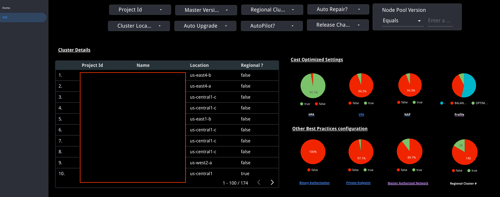
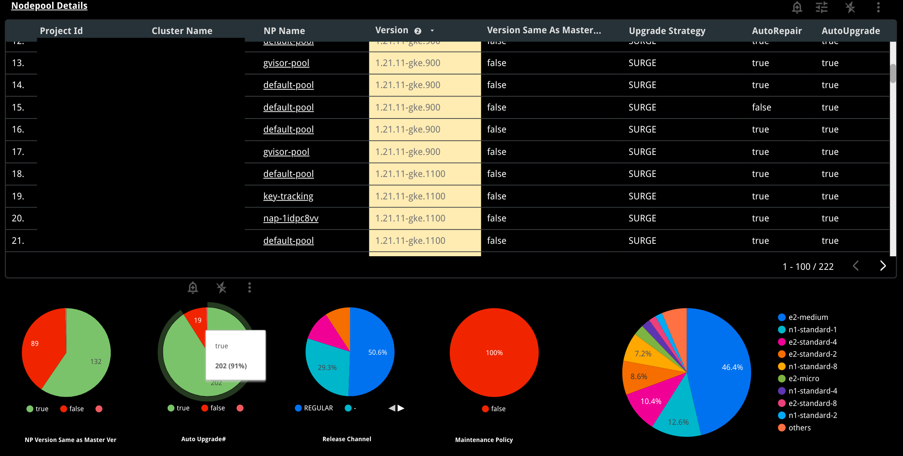
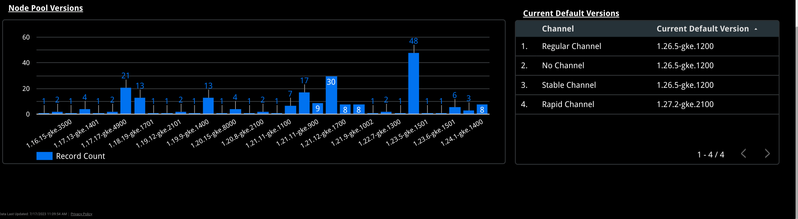

# KnowYourOrg

## Use cases

### Large GKE consumer customer  (Thousands of gke clusters).

### Looking for inventory:
1. GKE control plane version.
2. GKE dataplane version.
3. Nodepool configuration.
4. Type of instances in use in each one of the clusters/node pools.

### How good is our GKE setup?
1. Security settings.
2. Network settings.
3. HA/DR.

## What this utility does?
1. Iterate Projects
2. Iterate GKE Clusters
3. Retrieve GKE Details
4. Load the GKE details into BQ
5. Dashboard to view the data in BQ

## About Dashboard

The Dashboard provides all GKE clusters in your org. Normally you need to visit all projects individually to get this data which is not ideal for observing your org
 
Sections are separated based on:
1. Cluster level
2. Node Pool level
3. Common Pillars

All Pie charts are based on important categories to give a quick view about the cluster settings across the org.
Examples:
1. Regional Cluster # - Highlight the need of extra DR/HA for Zonal & Egress cost for Regional.
2. if Node Pool versions do not match Master, upgrades need to be looked at.
3. If there are many versions in your org, operators are going to have tough Day 2 activities.
4. The Scale setting sections provide how much elasticity is configured.
5. The security setting sections provide how to secure your clusters.
6. The Network setting sections provide how network policies are maintained.

# Screenshots

